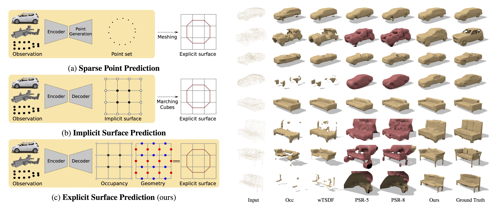

# Deep Marching Cubes
This repo contains training and testing code for "Deep Marching Cubes: Learning Explicit Surface Representations". More information about the project can be found in our [paper](http://www.cvlibs.net/publications/Liao2018CVPR.pdf), [suppmat](http://www.cvlibs.net/publications/Liao2018CVPR_supplementary.pdf) and [project website](https://avg.is.tue.mpg.de/research_projects/deep-marching-cubes).



If you find our code helpful, please cite:

	@INPROCEEDINGS{Liao2018CVPR,
  		author = {Yiyi Liao and Simon Donn\'{e} and Andreas Geiger},
  		title = {Deep Marching Cubes: Learning Explicit Surface Representations},
  		booktitle = {Conference on Computer Vision and Pattern Recognition (CVPR)},
  		year = {2018}
	}


## Installation
 
* pytorch, 0.3.0 (incompatible with 0.4.0)
* Build the C/Cuda extensions of pytorch with ```./build.sh```. Please add the cuda bin folder to the PATH variable if the Cuda extensions are needed.
* For evaluating the mesh-to-mesh distance, please check `tool/mesh-evaluation/README.md` and build the evaluation tool.


## Data
For experiments on 3D ShapeNet, please download the [data](https://s3.eu-central-1.amazonaws.com/avg-projects/deep_marching_cubes_data.zip) used in the paper including:

* Point cloud input for training and validation, also utilized for supervision
* Volumetric input for training and validation
* Ground truth mesh of the validation samples 

## Quick training demo

Training with toy data at a low resolution (grid size 8x8x8):

    cd marching_cube
    python train.py

where the points are sampled from ellipsoids.


## 3D Shape Prediction from Point Cloud 

There are some scripts in the `marching_cube` folder for reimplementing our 3D shape prediction experiments.

### Train

Training with ShapeNet data for reimplementing the experiment in the paper (grid size 32x32x32). Please change the `$DATA_DIR` below to where the downloaded data located.

    ./train.sh point $DATA_DIR $OUTPUT_DIR

During training, the visualization results will be saved in ```$OUTPUT_DIR``` in .png format for debugging.

### Validation

For validation, we first save the predicted mesh and then evaluate the mesh-to-mesh distance:

    ./val.sh point $DATA_DIR $OUTPUT_DIR $MODEL_FILE

During validation, the predicted mesh will be saved as .off files, the 2D visualization results are skipped for efficiency consideration.

## 3D Shape Prediction from Occupancy Grid

### Train

Similarly, we can train the network taking binary occupancy grid as input:

    ./train.sh voxel $DATA_DIR $OUTPUT_DIR

### Validation

Run the validation phase:

    ./val.sh voxel $DATA_DIR $OUTPUT_DIR $MODEL_FILE


## License
---


Copyright 2018 Autonomous Vision Group

Permission is hereby granted, free of charge, to any person obtaining a copy of this software and associated documentation files (the "Software"), to deal in the Software without restriction, including without limitation the rights to use, copy, modify, merge, publish, distribute, sublicense, and/or sell copies of the Software, and to permit persons to whom the Software is furnished to do so, subject to the following conditions:

The above copyright notice and this permission notice shall be included in all copies or substantial portions of the Software.

THE SOFTWARE IS PROVIDED "AS IS", WITHOUT WARRANTY OF ANY KIND, EXPRESS OR IMPLIED, INCLUDING BUT NOT LIMITED TO THE WARRANTIES OF MERCHANTABILITY, FITNESS FOR A PARTICULAR PURPOSE AND NONINFRINGEMENT. IN NO EVENT SHALL THE AUTHORS OR COPYRIGHT HOLDERS BE LIABLE FOR ANY CLAIM, DAMAGES OR OTHER LIABILITY, WHETHER IN AN ACTION OF CONTRACT, TORT OR OTHERWISE, ARISING FROM, OUT OF OR IN CONNECTION WITH THE SOFTWARE OR THE USE OR OTHER DEALINGS IN THE SOFTWARE.

---
